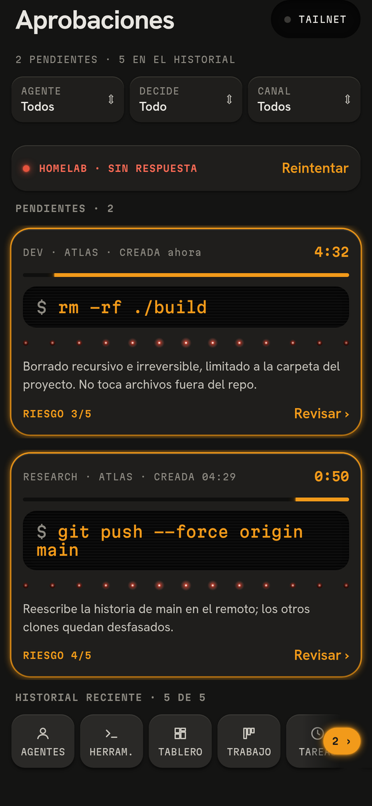
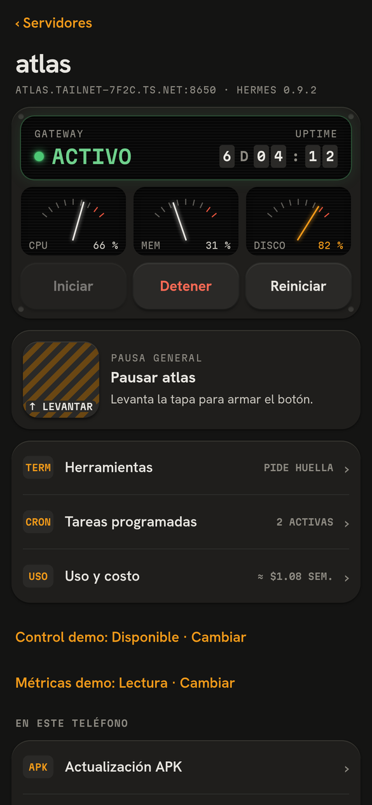
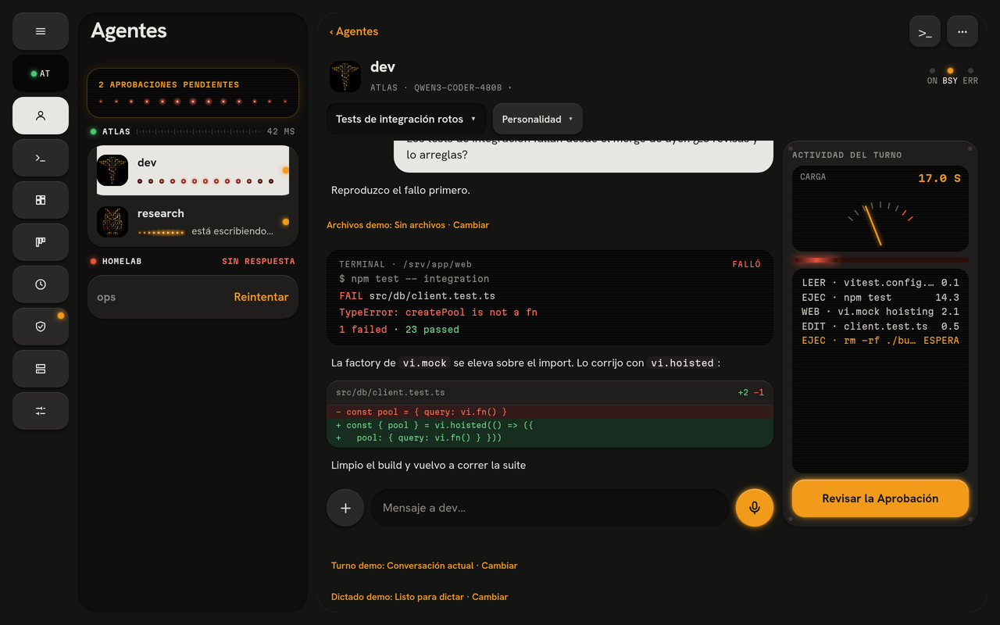

<p align="center">
  
</p>

# Relay

**Tus Agentes de Hermes, a la mano.** Relay es una app Android para operar Agentes de [Hermes](https://github.com/NousResearch/hermes-agent) en tus propias máquinas a través de tu tailnet de Tailscale. Habla con tus Agentes, aprueba sus comandos con tu huella y ten tus Servidores a la vista desde el teléfono o la tablet.

<p align="center">
  <a href="#instalar">Instalar</a> ·
  <a href="#probar-la-demo">Probar la demo</a> ·
  <a href="#estado">Estado</a> ·
  <a href="https://discord.gg/vcWpmXuFG">Discord</a> ·
  <a href="https://buymeacoffee.com/relayapp">Apoyar Relay</a> ·
  <a href="README.md">English</a>
</p>

**Teléfono y tablet Android · Servidores Linux · Autoalojado · Expo / React Native · AGPL-3.0**

La app está en español. Las especificaciones y decisiones de `docs/` también; las guías de instalación están en inglés. No hay APK publicado: la app se compila en local.

## Qué hace

| | |
|---|---|
| **Habla con tus Agentes** | Conversaciones con búsqueda, Markdown, imágenes y archivos del Servidor adjuntos, dictado en el teléfono y modelo por Conversación. |
| **Sigue y corrige** | Progreso del Turno en vivo, actividad de herramientas, detener y redirigir, y reconexión sin reenviar tu mensaje por su cuenta. |
| **Decide cuando importa** | Aprobaciones pendientes con cuenta atrás y riesgo. Aprobar pide mantener pulsado y tu huella; una Decisión vencida no envía nada. |
| **Ten el Servidor a la vista** | Agujas de CPU, memoria y disco, uptime del gateway, iniciar, detener y reiniciar, Pausa general, logs, Tareas programadas y uso y costo por Agente o modelo. |
| **Trabaja en el Servidor** | Herramientas con huella por Servidor: terminales completas (tmux funciona), explorador y editor de archivos, aplicaciones web locales dentro de Relay y control de un Chrome dedicado o del habitual. |
| **Ajusta un Agente** | Memoria y personalidad con la versión anterior guardada, Modo de aprobación, reglas de bloqueo, herramientas y Skills. |
| **Tablero y Trabajo** | Un Tablero de Tarjetas nativas que publican los Agentes y un Kanban de Trabajo compartido con ellos. |
| **Se adapta al aparato** | Barra de pestañas en teléfono, riel lateral en tablet con lista y Conversación lado a lado, tema oscuro, widget y notificaciones. |

## Capturas

<p align="center">
  <a href="docs/assets/readme/agents.png"></a>
  <a href="docs/assets/readme/chat.png"></a>
  <a href="docs/assets/readme/approvals.png"></a>
  <a href="docs/assets/readme/server.png"></a>
</p>

<p align="center">
  <a href="docs/assets/readme/tablet.png"></a>
</p>

Capturas de la demo web sintética en tema oscuro, no maquetas. Nombres, mensajes y métricas son de ejemplo, y los enlaces naranjas «Demostración … · Cambiar» son controles de la demo.

## Instalar

1. **Servidor y teléfono.** Hace falta Hermes ya instalado en Linux, Node.js 26 o posterior, Python 3 con PyYAML, sesión systemd de usuario y Tailscale conectado en el Servidor y en el Android, con MagicDNS y acceso al puerto del Puente (normalmente `8650`).
2. **Instalador guiado**, en el Servidor:

   ```bash
   git clone https://github.com/AlejandroFloresArroyo/relay.git
   cd relay
   ./scripts/bridge-wizard.sh
   ```

   Comprueba los requisitos, pregunta antes de instalar y conserva los perfiles y la configuración de Hermes. Detalles en la [guía de instalación](docs/bridge-install.md) (en inglés). Las herramientas del Servidor necesitan además el supervisor: [`docs/v3-install.md`](docs/v3-install.md).
3. **App y emparejamiento.** Compila el APK con la [guía de Android](mobile/README.md#build-the-android-app), abre Relay, añade un Servidor y escanea el QR del instalador. El código caduca a los cinco minutos; `cd bridge && ./relayd pair` da otro.

## Probar la demo

```bash
./scripts/prepare-dev.sh
cd mobile
npm run demo
```

Sin Hermes, Tailscale ni compilar para Android. Muchas pantallas tienen controles para ver estados como carga, vacío, error o desconexión.

## Estado

Relay es un proyecto de una persona, construido en abierto con agentes de código. Versión actual: **3.1.0**. Las herramientas del Servidor se aceptaron en un laboratorio con el Puente, el supervisor, las terminales y los navegadores reales frente a un Hermes simulado, y en una tablet emulada. Faltan el recorrido en aparatos físicos y Tailscale Services/HTTPS reales ([matriz](docs/relay-v3-matriz.md)). Solo se prueban Servidores Linux x86_64.

## Licencia

[GNU Affero General Public License v3.0](LICENSE). Si modificas Relay y dejas que otros lo usen por red, tienes que ofrecerles tu código fuente.
