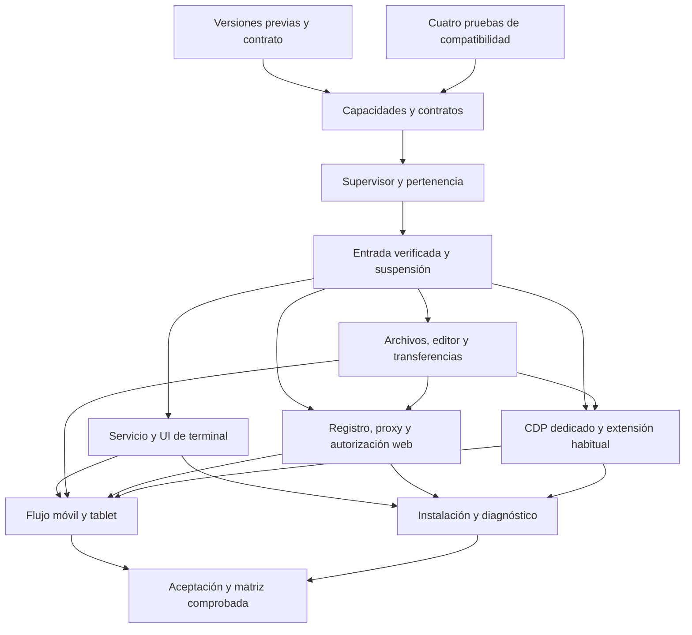

# Plan de implementación de Relay V3

Preparado el 2026-10-04 por petición de Ale. **Solo planificación:** no se inician validaciones ni construcción, no se instalan componentes y no se configura producción o Tailscale.

Seguimiento canónico: [Construir Relay V3: herramientas remotas del Servidor](https://github.com/AlejandroFloresArroyo/relay-app/issues/74). Los criterios de cada tarea viven en su issue; este documento resume orden y dependencias. El [contrato acordado](../relay-v3.md) permanece cerrado y el [mapa de decisiones](https://github.com/AlejandroFloresArroyo/relay-app/issues/61) conserva sus fundamentos.

## Base y prioridad

Los pendientes de v1 y su orden posterior no se sustituyen por V3. La tarea de preparación de base depende nativamente de las entregas vigentes de v1, y exige respetar las versiones previas antes de integrar código V3. Las cuatro validaciones aisladas pueden tomarse antes: no añaden funciones ni dependencias al producto de v1.

El contrato y glosario proceden de `plan/relay-v3`, commit `13c2f53`. Esta guía vive en `plan/v3-implementation`, sobre esa rama; ambas siguen locales hasta su integración por el orquestador. Un constructor parte de `dev` actualizado cuando se habilite su tarea, incorporando los activos necesarios; no usa una base vieja por el mero hecho de existir un worktree de planificación.

## Corte previo y matriz inicial

V3 se construye sobre el primer `dev` que cumpla todo esto, con un gate completo verde en ese mismo commit:

1. v1 cerrada con evidencia: #19 y #37–#48 cerrados, cada uno con commit, pruebas y resultado. Un issue abierto no cumple esta condición, aunque diga lo que falta. Lo que solo puede comprobarse en el teléfono o con Hermes real queda como pendiente nativo a cargo de Ale, como acuerdan los documentos de cierre de v1 ([implementación](../v1-implementation.md) y [auditoría](../audits/v1-closure-3784e38.md)). Exceptuar un issue solo puede hacerlo Ale, y la excepción consta en ese issue.
2. Contrato y glosario de `plan/relay-v3` (`13c2f53`) incorporados a `dev` en `1239b1a`. Ese merge solo toca `CONTEXT.md`, `docs/relay-v3.md`, la planificación y una nota de investigación; `docs/relay-v1.md` sigue siendo el contrato de v1.
3. v2 (`feat/complete-v2`) integrada en `dev`. No entra código de V3 antes. Las validaciones #76–#79 trabajan en laboratorios aislados y pueden avanzar en paralelo porque no integran código del producto.
4. [ADR 0006](../adr/0006-capacidades-remotas-v3.md) aceptada: capacidades remotas, contratos compartidos y lo que fija cada validación.

El orquestador registra en #75 el SHA de `dev` que cumple las cuatro condiciones. Ese commit es la base de #80 y de las tareas que dependen de él.

La matriz inicial dice qué se va a probar, no qué funciona. Una fila pasa a certificada solo con evidencia de la tarea indicada, por versión exacta.

| Componente | Objetivo inicial | Observado sin certificar (2026-10-05) | Certifica |
|---|---|---|---|
| Servidor | Linux con systemd y cgroup v2 | Equipo de laboratorio: Arch Linux (Omarchy), Linux 7.2.5 x86_64, glibc 2.44, systemd 261, cgroup v2 (`cgroup2fs`). Otras distribuciones y glibc sin probar | #76, #81, #97 |
| Arquitectura del Servidor | x86_64; arm64 solo si se prueba | Solo x86_64. #76 dejó linux-arm64 como NO PROBADO | #97 |
| Node del Puente y supervisor | Node 26 | v26.10.0 en #76 (ABI 147, N-API 10). `engines >=26` admite Node 27 y posteriores, que no se prueban | #76, #97 |
| PTY | node-pty 1.1.0 compilada en el Servidor, dentro del supervisor ([ADR 0006](../adr/0006-capacidades-remotas-v3.md)) | Laboratorio #76 ([resultado](../research/v3-pty.md)): 1.1.0 compilada (GCC 16.2.1, make 4.4.1, Python 3.14.7; el binario exige `GLIBC_2.42`) y 1.2.0-beta.15 con prebuild (`GLIBC_2.28`), 8/8 cada una. Sin compilador, 1.1.0 no se instala. Supervivencia del supervisor bajo systemd sin probar | #76 (laboratorio), #81 (systemd), #97 |
| tmux dentro de la terminal | Lo usa la persona; Relay no lo gestiona | tmux 3.7c en #76 | #83, #97 |
| App | Android teléfono y tablet, Relay Dev y APK propio | Emulador Android 16 (`emulator-5560`, AVD de laboratorio, observado en la revisión de la base); teléfono físico no confirmado; ninguna tablet registrada | #77, #95, #97 |
| Teclado | Virtual en español con IME, y físico | Sin probar | #77 |
| Navegador del Servidor | Chrome y Chromium, dedicado (CDP) y habitual (extensión) | Chromium 152.0.7977.82 y Google Chrome 154.0.8037.57 instalados | #78, #92, #93 |
| Web externa | HTTPS con Tailscale Services por aplicación | Solo simulado en el laboratorio de #79, sin integrar. En esta tailnet, Serve HTTPS y Services reales responden «Serve is not enabled on your tailnet»; necesita aprobación en la tailnet | #79, #96 |

No forman parte de la matriz inicial: Servidores macOS o Windows, Firefox y Safari como navegador del Servidor, ni iPhone o iPad. Una versión vecina de las probadas no se da por compatible.

## Primer trabajo disponible

- [V3: validar node-pty con Node 26 en Linux](https://github.com/AlejandroFloresArroyo/relay-app/issues/76): compatibilidad nativa y requisitos de compilación del PTY, sin tocar el Puente real.
- [V3: validar xterm en Expo 57 y Android](https://github.com/AlejandroFloresArroyo/relay-app/issues/77): Expo DOM/WebView Android, IME y teclado, sin sustituir evidencia nativa por una prueba en Chrome.
- [V3: validar CDP y extensión en navegadores de prueba](https://github.com/AlejandroFloresArroyo/relay-app/issues/78): CDP dedicado y extensión/native messaging del navegador habitual sintético.
- [V3: validar proxy HTTPS y aislamiento web con aplicaciones falsas](https://github.com/AlejandroFloresArroyo/relay-app/issues/79): proxy, cookies, handoff y visor con aplicaciones falsas; Services real se simula y no se configura.

Una prueba que falle no se convierte en PASS por documentación. Se registra la incompatibilidad y se resuelve una alternativa antes de cerrar su issue y desbloquear el código dependiente. Si la alternativa obliga a cambiar el contrato de producto, se abre una decisión nueva enlazada al contrato; no se cambia el alcance durante la implementación.

## Orden de construcción

El esquema resume etapas; las relaciones exactas son las dependencias nativas de los issues. No se empieza una entrega bloqueada porque un diagrama resumido omita una dependencia interna.

## Tareas

| Tarea | Etapa | Clase | Depende de |
|---|---|---|---|
| [V3: preparar la base después de las versiones previas](https://github.com/AlejandroFloresArroyo/relay-app/issues/75) | Base | architectural | Sin tareas internas previas; entregas vigentes de v1 enlazadas en el issue |
| [V3: validar node-pty con Node 26 en Linux](https://github.com/AlejandroFloresArroyo/relay-app/issues/76) | Compatibilidad aislada | architectural | Sin tareas internas previas |
| [V3: validar xterm en Expo 57 y Android](https://github.com/AlejandroFloresArroyo/relay-app/issues/77) | Compatibilidad aislada | architectural | Sin tareas internas previas |
| [V3: validar CDP y extensión en navegadores de prueba](https://github.com/AlejandroFloresArroyo/relay-app/issues/78) | Compatibilidad aislada | architectural | Sin tareas internas previas |
| [V3: validar proxy HTTPS y aislamiento web con aplicaciones falsas](https://github.com/AlejandroFloresArroyo/relay-app/issues/79) | Compatibilidad aislada | architectural | Sin tareas internas previas |
| [V3: añadir contratos y capacidades remotas compatibles](https://github.com/AlejandroFloresArroyo/relay-app/issues/80) | Base | architectural | [V3: preparar la base después de las versiones previas](https://github.com/AlejandroFloresArroyo/relay-app/issues/75) [V3: validar node-pty con Node 26 en Linux](https://github.com/AlejandroFloresArroyo/relay-app/issues/76) [V3: validar xterm en Expo 57 y Android](https://github.com/AlejandroFloresArroyo/relay-app/issues/77) [V3: validar CDP y extensión en navegadores de prueba](https://github.com/AlejandroFloresArroyo/relay-app/issues/78) [V3: validar proxy HTTPS y aislamiento web con aplicaciones falsas](https://github.com/AlejandroFloresArroyo/relay-app/issues/79) |
| [V3: conservar y terminar entornos propios por dispositivo](https://github.com/AlejandroFloresArroyo/relay-app/issues/81) | Base | high-risk | [V3: añadir contratos y capacidades remotas compatibles](https://github.com/AlejandroFloresArroyo/relay-app/issues/80) |
| [V3: verificar entrada remota y suspender control al bloquear](https://github.com/AlejandroFloresArroyo/relay-app/issues/82) | Base | high-risk | [V3: añadir contratos y capacidades remotas compatibles](https://github.com/AlejandroFloresArroyo/relay-app/issues/80) [V3: conservar y terminar entornos propios por dispositivo](https://github.com/AlejandroFloresArroyo/relay-app/issues/81) |
| [V3: exponer terminal interactiva autenticada por el Puente](https://github.com/AlejandroFloresArroyo/relay-app/issues/83) | Terminal | high-risk | [V3: conservar y terminar entornos propios por dispositivo](https://github.com/AlejandroFloresArroyo/relay-app/issues/81) [V3: verificar entrada remota y suspender control al bloquear](https://github.com/AlejandroFloresArroyo/relay-app/issues/82) |
| [V3: construir terminal con pestañas y teclado móvil](https://github.com/AlejandroFloresArroyo/relay-app/issues/84) | Terminal | high-risk | [V3: exponer terminal interactiva autenticada por el Puente](https://github.com/AlejandroFloresArroyo/relay-app/issues/83) [V3: validar xterm en Expo 57 y Android](https://github.com/AlejandroFloresArroyo/relay-app/issues/77) |
| [V3: implementar operaciones del explorador de archivos](https://github.com/AlejandroFloresArroyo/relay-app/issues/85) | Archivos | high-risk | [V3: añadir contratos y capacidades remotas compatibles](https://github.com/AlejandroFloresArroyo/relay-app/issues/80) [V3: verificar entrada remota y suspender control al bloquear](https://github.com/AlejandroFloresArroyo/relay-app/issues/82) |
| [V3: guardar texto sin pérdida y proteger perfiles de Hermes](https://github.com/AlejandroFloresArroyo/relay-app/issues/86) | Archivos | high-risk | [V3: implementar operaciones del explorador de archivos](https://github.com/AlejandroFloresArroyo/relay-app/issues/85) |
| [V3: transferir y buscar archivos con progreso y cancelación](https://github.com/AlejandroFloresArroyo/relay-app/issues/87) | Archivos | high-risk | [V3: implementar operaciones del explorador de archivos](https://github.com/AlejandroFloresArroyo/relay-app/issues/85) [V3: guardar texto sin pérdida y proteger perfiles de Hermes](https://github.com/AlejandroFloresArroyo/relay-app/issues/86) |
| [V3: construir explorador, editor y transferencias en Android](https://github.com/AlejandroFloresArroyo/relay-app/issues/88) | Archivos | high-risk | [V3: implementar operaciones del explorador de archivos](https://github.com/AlejandroFloresArroyo/relay-app/issues/85) [V3: guardar texto sin pérdida y proteger perfiles de Hermes](https://github.com/AlejandroFloresArroyo/relay-app/issues/86) [V3: transferir y buscar archivos con progreso y cancelación](https://github.com/AlejandroFloresArroyo/relay-app/issues/87) |
| [V3: descubrir aplicaciones locales y servirlas por el Puente](https://github.com/AlejandroFloresArroyo/relay-app/issues/89) | Web | high-risk | [V3: añadir contratos y capacidades remotas compatibles](https://github.com/AlejandroFloresArroyo/relay-app/issues/80) [V3: verificar entrada remota y suspender control al bloquear](https://github.com/AlejandroFloresArroyo/relay-app/issues/82) [V3: validar proxy HTTPS y aislamiento web con aplicaciones falsas](https://github.com/AlejandroFloresArroyo/relay-app/issues/79) |
| [V3: conceder y revocar autorización web externa de una hora](https://github.com/AlejandroFloresArroyo/relay-app/issues/90) | Web | high-risk | [V3: descubrir aplicaciones locales y servirlas por el Puente](https://github.com/AlejandroFloresArroyo/relay-app/issues/89) [V3: conservar y terminar entornos propios por dispositivo](https://github.com/AlejandroFloresArroyo/relay-app/issues/81) [V3: verificar entrada remota y suspender control al bloquear](https://github.com/AlejandroFloresArroyo/relay-app/issues/82) |
| [V3: abrir webs en Relay y en el navegador del teléfono](https://github.com/AlejandroFloresArroyo/relay-app/issues/91) | Web | high-risk | [V3: descubrir aplicaciones locales y servirlas por el Puente](https://github.com/AlejandroFloresArroyo/relay-app/issues/89) [V3: conceder y revocar autorización web externa de una hora](https://github.com/AlejandroFloresArroyo/relay-app/issues/90) [V3: construir explorador, editor y transferencias en Android](https://github.com/AlejandroFloresArroyo/relay-app/issues/88) |
| [V3: controlar un navegador dedicado del Servidor](https://github.com/AlejandroFloresArroyo/relay-app/issues/92) | Navegador | high-risk | [V3: conservar y terminar entornos propios por dispositivo](https://github.com/AlejandroFloresArroyo/relay-app/issues/81) [V3: verificar entrada remota y suspender control al bloquear](https://github.com/AlejandroFloresArroyo/relay-app/issues/82) [V3: validar CDP y extensión en navegadores de prueba](https://github.com/AlejandroFloresArroyo/relay-app/issues/78) [V3: transferir y buscar archivos con progreso y cancelación](https://github.com/AlejandroFloresArroyo/relay-app/issues/87) |
| [V3: controlar pestañas elegidas del navegador habitual](https://github.com/AlejandroFloresArroyo/relay-app/issues/93) | Navegador | high-risk | [V3: conservar y terminar entornos propios por dispositivo](https://github.com/AlejandroFloresArroyo/relay-app/issues/81) [V3: verificar entrada remota y suspender control al bloquear](https://github.com/AlejandroFloresArroyo/relay-app/issues/82) [V3: validar CDP y extensión en navegadores de prueba](https://github.com/AlejandroFloresArroyo/relay-app/issues/78) [V3: transferir y buscar archivos con progreso y cancelación](https://github.com/AlejandroFloresArroyo/relay-app/issues/87) |
| [V3: construir controles de páginas del navegador del Servidor](https://github.com/AlejandroFloresArroyo/relay-app/issues/94) | Navegador | high-risk | [V3: controlar un navegador dedicado del Servidor](https://github.com/AlejandroFloresArroyo/relay-app/issues/92) [V3: controlar pestañas elegidas del navegador habitual](https://github.com/AlejandroFloresArroyo/relay-app/issues/93) [V3: construir explorador, editor y transferencias en Android](https://github.com/AlejandroFloresArroyo/relay-app/issues/88) |
| [V3: integrar herramientas por Servidor y dos paneles en tablet](https://github.com/AlejandroFloresArroyo/relay-app/issues/95) | Integración | high-risk | [V3: construir terminal con pestañas y teclado móvil](https://github.com/AlejandroFloresArroyo/relay-app/issues/84) [V3: construir explorador, editor y transferencias en Android](https://github.com/AlejandroFloresArroyo/relay-app/issues/88) [V3: abrir webs en Relay y en el navegador del teléfono](https://github.com/AlejandroFloresArroyo/relay-app/issues/91) [V3: construir controles de páginas del navegador del Servidor](https://github.com/AlejandroFloresArroyo/relay-app/issues/94) |
| [V3: preparar instalación, diagnóstico y publicación web manual](https://github.com/AlejandroFloresArroyo/relay-app/issues/96) | Integración | architectural | [V3: exponer terminal interactiva autenticada por el Puente](https://github.com/AlejandroFloresArroyo/relay-app/issues/83) [V3: descubrir aplicaciones locales y servirlas por el Puente](https://github.com/AlejandroFloresArroyo/relay-app/issues/89) [V3: conceder y revocar autorización web externa de una hora](https://github.com/AlejandroFloresArroyo/relay-app/issues/90) [V3: controlar un navegador dedicado del Servidor](https://github.com/AlejandroFloresArroyo/relay-app/issues/92) [V3: controlar pestañas elegidas del navegador habitual](https://github.com/AlejandroFloresArroyo/relay-app/issues/93) |
| [V3: verificar aceptación y publicar matriz de compatibilidad](https://github.com/AlejandroFloresArroyo/relay-app/issues/97) | Aceptación | high-risk | [V3: integrar herramientas por Servidor y dos paneles en tablet](https://github.com/AlejandroFloresArroyo/relay-app/issues/95) [V3: preparar instalación, diagnóstico y publicación web manual](https://github.com/AlejandroFloresArroyo/relay-app/issues/96) |

## Límites que atraviesan varias entregas

- **Pertenencia:** registrar desde la creación los entornos propios. El navegador habitual, incluidas pestañas creadas desde Relay, y tmux/herdr previos son compartidos. La revocación no puede clasificarlos por heurísticas de PID al final.
- **Escrituras de perfiles:** todas las rutas del explorador pasan por el mismo límite de conservación de versiones/registro. Editor, subida, mover, borrar o sobrescribir no son vías alternativas para saltarse esa protección.
- **Web:** terminal DOM local, web arbitraria embebida y navegador del Servidor son tres límites distintos. Las llaves del dispositivo nunca se entregan a una página. La autorización externa dura una hora y tiene alcance/corte activo independientes.
- **Compatibilidad:** los módulos auxiliares y dependencias se introducen solo en la tarea que los autoriza, después de su prueba. El Puente antiguo conserva funciones compatibles; una capacidad ausente no se prueba mandando operaciones nuevas.
- **Hardware y despliegue:** mocks/componentes no certifican comportamiento del teclado/WebView, supervivencia systemd o publicación Services real. Las comprobaciones reales se registran por versión/configuración y permanecen pendientes si no hay entorno autorizado.

## Forma de ejecutar cada tarea

Un worktree por tarea, con `dev` como rama de integración; test-first y la prueba más estrecha durante el cambio. Los componentes usan el arnés Android del repo con core/AppProvider reales y límites declarados. Las guardas de Fails silently requieren mutación temporal, evidencia de aserción fallida, restauración y verde.

Cada entrega nueva aporta demo de sus estados, revisa los lienzos/tokens Instrumento aplicables y pasa el gate completo y los presupuestos de AGENTS.md. Commits, merge a `dev`, APK y modelos por rol siguen `AGENTS.md`.

Los laboratorios prefieren archivos, perfiles, puertos efímeros y procesos de prueba. Desde el 2026-10-05 Ale autoriza usar Hermes, el Puente, Tailscale Serve/Services y firewall cuando la tarea lo necesite, con las condiciones de «Production access» en `AGENTS.md`: respaldo y registro de escrituras en Hermes, secretos fuera de logs y reversión de cambios de red de laboratorio.

## Cierre

La última entrega demuestra los escenarios de aceptación del contrato y publica la matriz de versiones/arquitecturas/componentes realmente probados. No se anuncia V3 lista con sub-issues abiertos o pruebas nativas/administrativas requeridas ausentes. El despliegue de producción queda en una tarea operativa posterior, y no se fija fecha por crear este plan.
