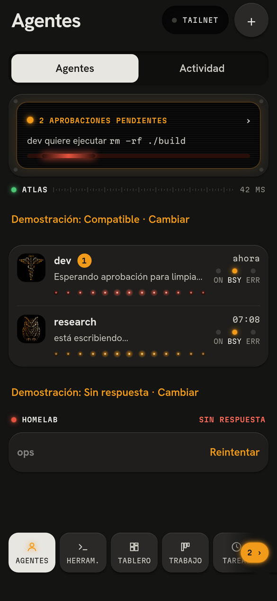
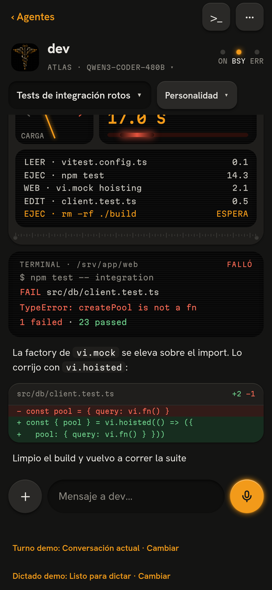

<p align="center">
  <a href="../README.md"></a>
</p>

# Relay · Android app

The Expo 57 / React Native client for your Hermes agents. It connects exclusively to a paired Puente over your Tailscale tailnet. The current interface is in Spanish; this development and build guide is in English.

[Project overview](../README.md) · [Server installation](../docs/bridge-install.md) · [Discord](https://discord.gg/vcWpmXuFG) · [Support Relay](https://buymeacoffee.com/relayapp)

<p align="center">
  <a href="../docs/assets/readme/agents.png"></a>
  <a href="../docs/assets/readme/chat.png"></a>
</p>

## Start with the demo

From the repository root on Linux:

```bash
./scripts/prepare-dev.sh
cd mobile
npm run demo
```

Open the local URL printed by Expo. `EXPO_PUBLIC_RELAY_DEMO=1` selects synthetic clients and data: no Server or pairing is needed. Demo controls let you explore normal, loading, empty, error, disconnected, and recovery states. Screenshots above come from this web demo; they do not demonstrate native hardware behavior.

For a mobile-only checkout with dependencies already available, run `npm ci` here before `npm run demo`. The [development guide](../docs/development.md) covers prerequisite checks and platform limits.

## Build the Android app

Build locally with **Expo prebuild + Gradle**. No Expo account or EAS service is required. The generated `android/` directory is not tracked. Expo Go lacks the native modules required by Relay; use Relay Dev for native development.

### Android prerequisites

Provide **JDK 17** and an Android SDK. The recorded build environment used Android platform **36**, Build-Tools **36.0.0**, and NDK **27.1.12297006**; the generated Gradle project may request additional tools. Install Android's command-line tools or use Android Studio, accept the required SDK licenses, and configure your own paths:

```bash
export JAVA_HOME='<absolute-path-to-your-JDK-17>'
export ANDROID_HOME='<absolute-path-to-your-Android-SDK>'
export EXPO_NO_TELEMETRY=1
export PATH="$ANDROID_HOME/platform-tools:$PATH"
```

The checkout preparation script installs JavaScript dependencies, not Java or the Android SDK. Android/Gradle downloads may be needed on the first build.

### Relay Dev — no personal signing key required

Relay Dev has its own package (`io.github.alejandrofloresarroyo.relay.dev`), data, and `relay-dev` scheme. It can coexist with Relay and uses Android's debug signing key.

From `mobile/`:

```bash
APP_VARIANT=development npx expo prebuild --clean --platform android --no-install
(cd android && ./gradlew :app:assembleDebug)
adb devices
adb -s '<authorized-device-serial>' install -r android/app/build/outputs/apk/debug/app-debug.apk
adb -s '<authorized-device-serial>' reverse tcp:8081 tcp:8081
APP_VARIANT=development npx expo start --dev-client --localhost
```

Replace the serial placeholder with a device listed in the `device` state, then open Relay Dev and select Metro. Repeat `adb reverse` after reconnecting USB. Keep `APP_VARIANT=development` for both prebuild and Metro.

To use native demo data, start Metro with both flags:

```bash
APP_VARIANT=development EXPO_PUBLIC_RELAY_DEMO=1 npx expo start --dev-client --localhost
```

### Relay release — your own signing key

Use your own keystore and a private properties file **outside the repository**. It must contain `storeFile`, `keyAlias`, `storePassword`, and `keyPassword`; a relative `storeFile` resolves beside the properties file. Set `RELAY_SIGNING_PROPERTIES` to that file's absolute path, or use the plugin's default at `~/.config/relay/signing.properties`. Keep both files private and backed up.

You can create a new key interactively, using your own destination and certificate identity:

```bash
"$JAVA_HOME/bin/keytool" -genkeypair -keystore '<path-outside-the-repo>/relay-release.keystore' \
  -storetype PKCS12 -alias relay -keyalg RSA -keysize 4096 -validity 10000
```

The signing plugin reads your properties at build time; it does not embed passwords in the generated Gradle configuration. Missing signing fields fail the release build rather than using the public template debug key.

```bash
export RELAY_SIGNING_PROPERTIES='<absolute-path-to-your-private-signing.properties>'
APP_VARIANT=release npx expo prebuild --clean --platform android --no-install
(cd android && ./gradlew :app:assembleRelease)
adb devices
adb -s '<authorized-device-serial>' install -r android/app/build/outputs/apk/release/app-release.apk
```

The release package is `io.github.alejandrofloresarroyo.relay`. Updating while preserving app data requires the **same package and signing key**. A key you create cannot update someone else's signed APK.

For an ARM64-only phone build, append `-PreactNativeArchitectures=arm64-v8a` to the Gradle command. Omit it for other architectures. Check the resulting certificate with your SDK's `apksigner verify --print-certs`.

### Regeneration and variants

`prebuild --clean` regenerates the native project and may change `package.json` scripts: inspect the diff before keeping changes. Regenerate when native dependencies, config plugins, app configuration, or the variant change. JavaScript-only release updates can usually repeat Gradle; Relay Dev loads them from Metro.

Both variants share the generated directory. Before a release build, regenerate it with `APP_VARIANT=release` to avoid retaining Relay Dev's identity or local development network exceptions. Unknown `APP_VARIANT` values are rejected.

## Connect to your Server

Follow the [guided Puente installation](../docs/bridge-install.md), then scan its QR or enter the one-time code and full address. The app accepts plain HTTP only for full `*.ts.net` hostnames; a Tailscale IP, short name, or localhost address is not a supported production Server URL. HTTP travels inside Tailscale's encrypted connection. The app does not configure or start Tailscale.

Pairing is per device. Server keys use Android secure storage. Local fingerprint checks protect actions such as approving commands and reducing protection; app lock can also be configured. When the Server cannot be reached, Relay keeps known state and explains the failure without treating cached values as fresh.

## App behavior

| Area | Contract |
|---|---|
| **Conversations** | Create, open, rename, delete, and search titles or messages. The background filter is off initially. External and older unverified Conversations remain read-only for sending. Deletion confirms the current message count and rechecks changes. |
| **Turns** | Stop waits for Hermes's acknowledgment. Steer submits to the same Turn; acknowledgment means queued, not necessarily consumed. Unconsumed instructions return to the composer. Recovery preserves drafts and resumes the same Turn without automatically resending its input. |
| **Models** | Search and provider filters operate on the Server's catalog. A selection is saved for that Conversation. During a Turn, a confirmed change affects the next Turn. Answer attribution uses Hermes's reported runtime, not the requested model. |
| **Markdown** | Headings, lists, tables, quotes, links, and selectable code. Copy preserves the literal code content. Copy and link-opening errors are visible. |
| **Dictation** | Hold to speak, slide to cancel, release to finish. Recognition requires an installed on-device model; the current language is `es-US`. Missing model or permission is shown before listening. Text goes to the draft, never automatically to the agent. |
| **Agent files** | Download, open, and share announced files in the selected Conversation. Finished copies use the app's private cache; partial downloads are discarded on cancellation, exit, or failure. Other apps receive the finished file URI, not the device key. |

Drafts survive Conversation changes while the chat remains mounted. Changing agent or Server connection discards the old scope; late responses cannot replace the new history. Explicit send, stop, and steer errors stay near the composer.

`withDictationPrivacy.js` and the pinned speech-recognition dependency remove native debug transcript logging. This configuration and synthetic tests do not substitute for network capture or real-device validation. Agent file downloads are bounded at 50 MB; expiration, disappearance, and unsupported delivery are separate states.

## Project layout and checks

| Path | Purpose |
|---|---|
| `src/app/` | Expo Router routes. |
| `src/screens/` | Screen composition and interaction. |
| `src/core/` | Pure logic with colocated `node --test` tests. |
| `src/state/` | App state, polling, and storage. |
| `src/ui/`, `src/theme/tokens.ts` | K-1 UI primitives and design tokens. |
| `plugins/` | Native configuration, signing, and privacy integrations. |
| `tests/components/`, `tests/support/` | Android component tests and native/transport boundaries. |
| [`../protocol/protocol.ts`](../protocol/protocol.ts) | Shared wire contract. |

```bash
npm test
npm run test:components
npm run typecheck
npm run lint
```

From the repository root, `./scripts/gate.sh` runs the full validation, including Puente checks and web export. Tests use synthetic transport and native boundaries, never production Hermes or the running Puente. See [`AGENTS.md`](AGENTS.md) and the [V1 specification](../docs/relay-v1.md) before changing app behavior.

## Community and support

[Join Discord](https://discord.gg/vcWpmXuFG) to share feedback and follow progress. [Buy Me a Coffee](https://buymeacoffee.com/relayapp) to help fund **macOS and Windows Server support** and **preconfigured cloud VPS instances ready to deploy with one tap**. Those are future goals; current Server installation targets Linux.
